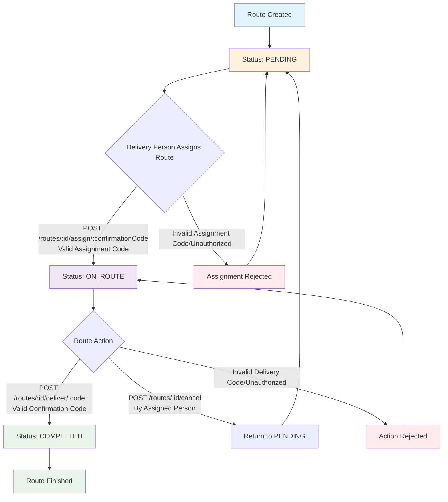
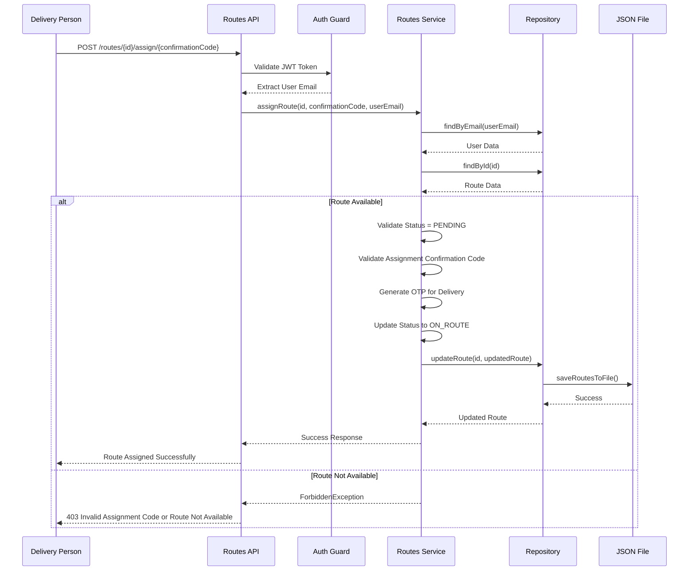
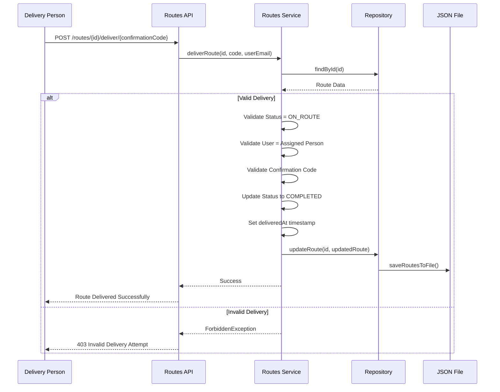
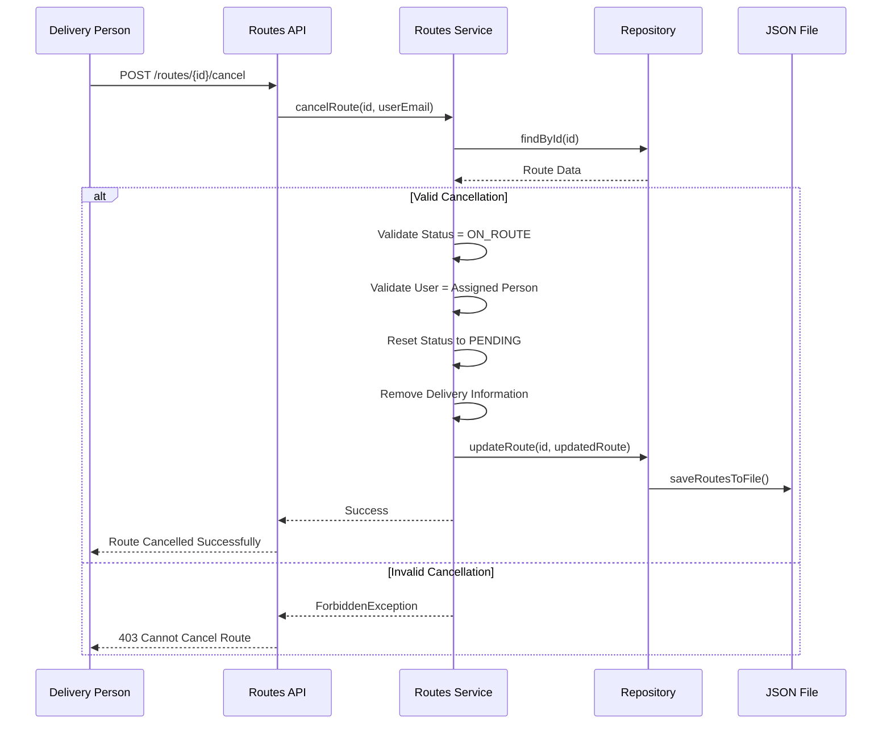
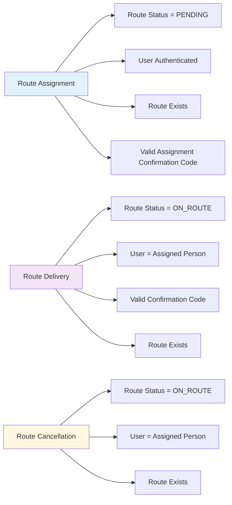
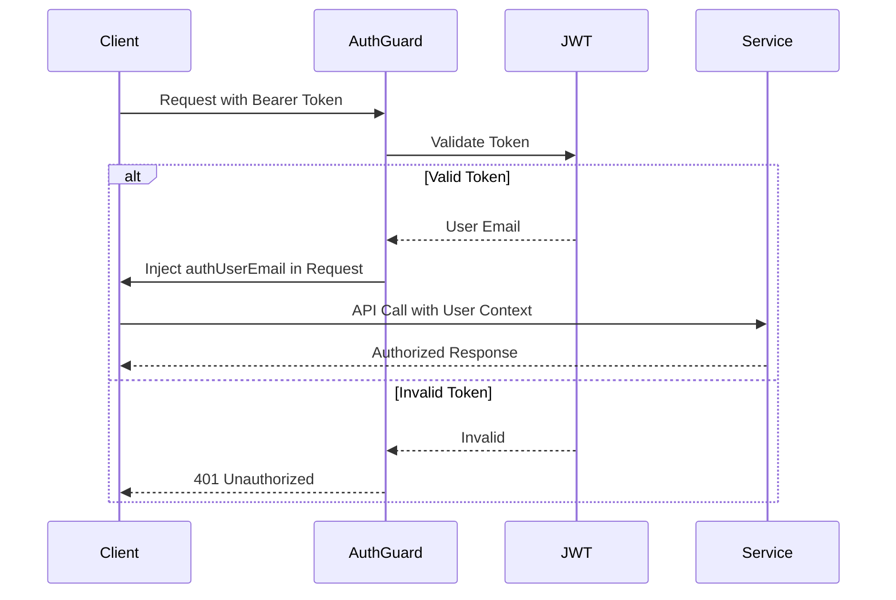

# Route Lifecycle and Validation Flow

## Route Status Lifecycle

## Detailed Route Assignment Flow

## Route Delivery Flow

## Route Cancellation Flow

## Validation Rules Summary

## Authentication Flow

## Key Features

### Security

- **JWT Authentication**: All endpoints require valid authentication
- **Authorization**: Users can only access/modify routes assigned to them
- **Automatic OTP Generation**: Delivery confirmation codes generated per assignment
- **Status Validation**: Strict status transition rules

### Data Management

- **In-Memory Performance**: Fast operations with Map-based storage
- **File Persistence**: Automatic JSON file synchronization
- **Consistent State**: Data integrity across server restarts

### Error Handling

- **Comprehensive Validation**: Multi-layer validation (authentication, authorization, business rules)
- **Descriptive Errors**: Clear error messages for debugging
- **Proper HTTP Codes**: Standard HTTP status codes for different error types
